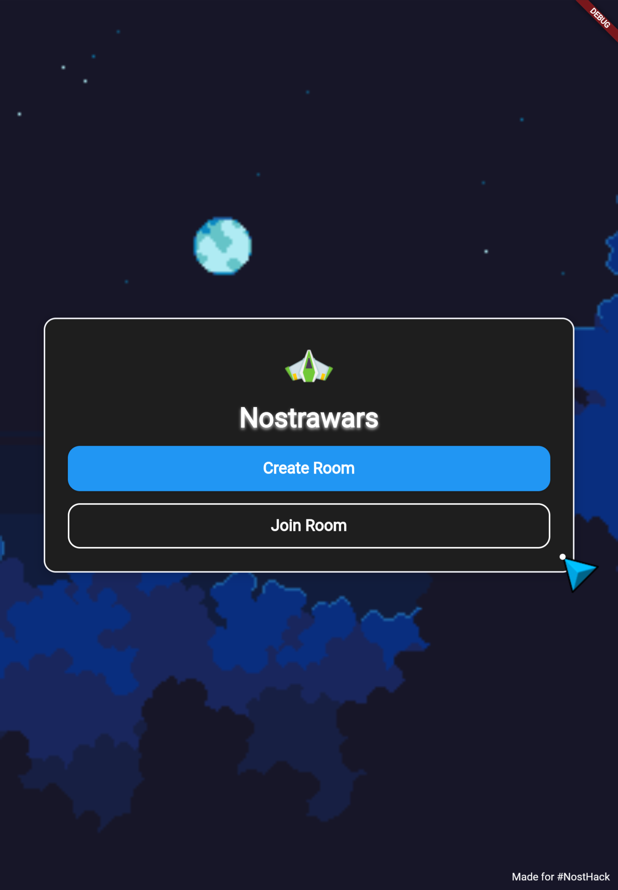
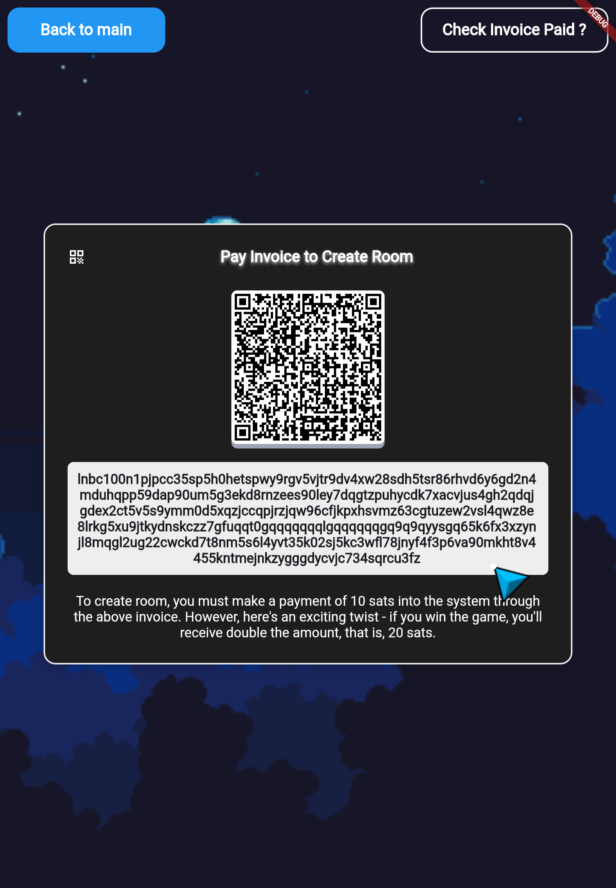
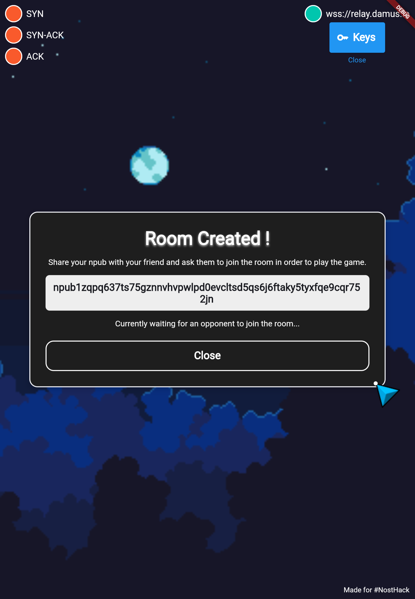
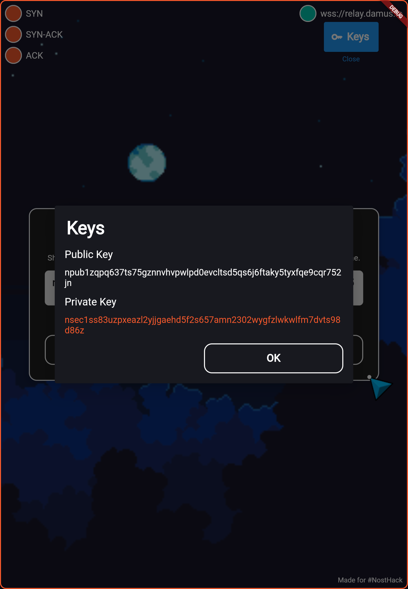
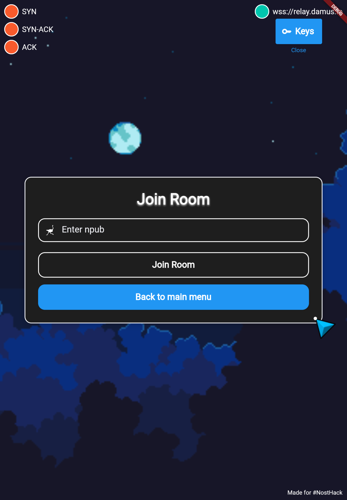
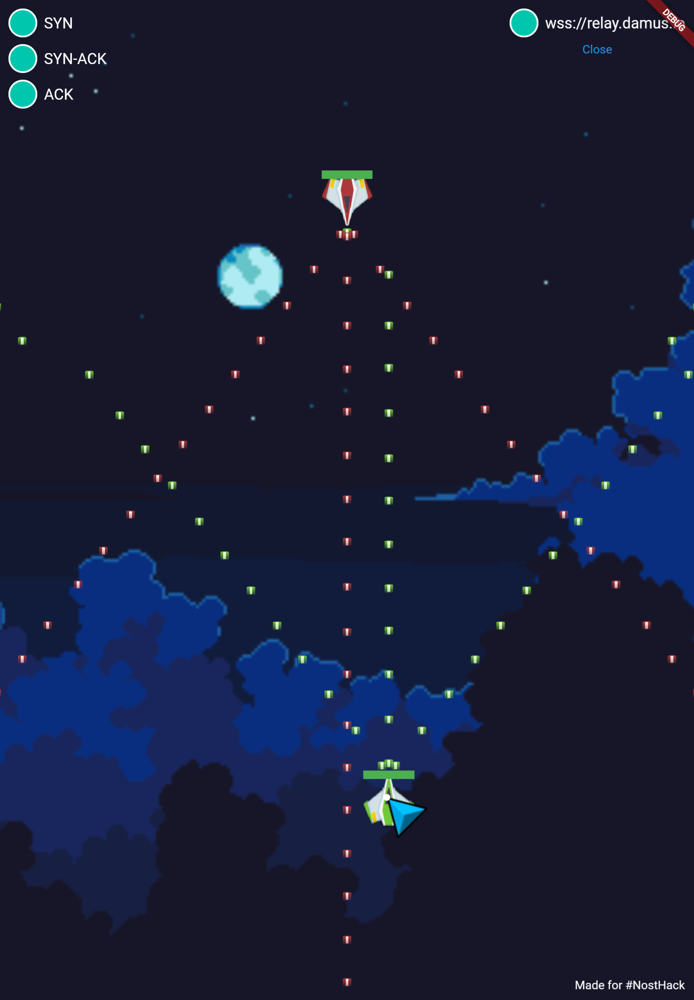
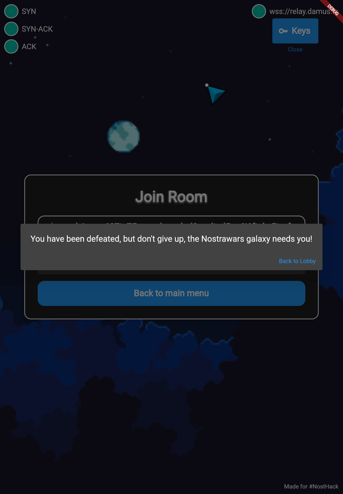
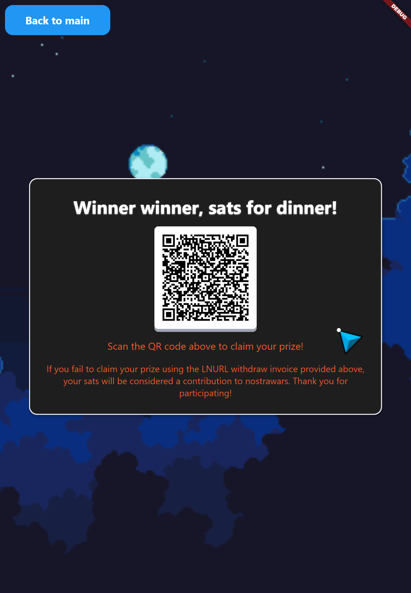

<div align="center">
    
</div>

<h1 align="center"> Nostrawars </h3>
<h3 align="center"> Nostrawars is a multiplayer space shooting game based on the Nostr protocol and LNBits! </h3>


[](https://www.youtube.com/watch?v=y5YkARcmy0w)


<div align="center">

# [Working Website](https://nostrawars.netlify.app/)

</div>

The game's technical stack includes Flutter Web, Flame Game Engine, Nostr protocol (NIP:04) package, and LNBits API, all of which combine to create an engaging and exciting gameplay experience.

## Screens Specification

   MainPage Screen                        |   PayInvoice Screen
:----------------------------------------:|:-------------------------:
  |  


   CreateRoom Screen                        |   Keys showDialog
:----------------------------------------:|:-------------------------:
  |  


   JoinRoom Screen                        |   Game Screen
:----------------------------------------:|:-------------------------:
  |  


   Player Lost showDialog                        |   WithdrawSats Screen
:----------------------------------------:|:-------------------------:
  |  


## Building

1. Clone the repo
2. Run `cd nostrawars`
3. Run `flutter pub get`
4. Create a new folder in root as `.env` and add the following content into it:

```.env
lnbits-invoice-key=<your_lnbits_invoice_key_here>
lnbits-admin-key=<your_lnbits_admin_key_here>
lnbits-base-url=https://legend.lnbits.com/api/v1
lnbits-withdraw-base-url=https://legend.lnbits.com/withdraw/api/v1
```
   - Paste your appropriate keys in the `.env` file removing the angle branckets (<>)

5. Run `flutter pub run build_runner build —delete-conflicting-outputs`
6. Run the project for web!

## Contributing:

 - Fork it!
 - Create your feature branch: `git checkout -b my-new-feature`
 - Commit your changes: `git commit -am 'Add some feature'`
 - Push to the branch: `git push origin my-new-feature`
 - Submit a pull request.

 <h3 align="center">Show some ❤ and star the repo to support the project</h3>
